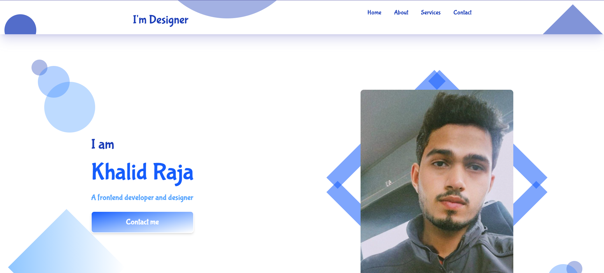

# Project Name  

## My Porfolio 

## Features  
- fully responsive for all screen sizes
- tailwind css class based design
- animations using animate.css libraray
- cutomisable icons from font awesome

## Demo  
👉 [Live Preview](https://khalid-raza03.github.io/my-portfolio-app/)  

## Screenshots


## Technologies  
- HTML5 
- Tailwind 4.1
- animate.css
- Vanilla JavaScript  

## Installation in local 

1. __Clone the repo:__  

   ```bash
   git clone https://github.com/khalid-raza03/my-porfolio-app.git
   ```
2. Open `index.html` in a browser.  